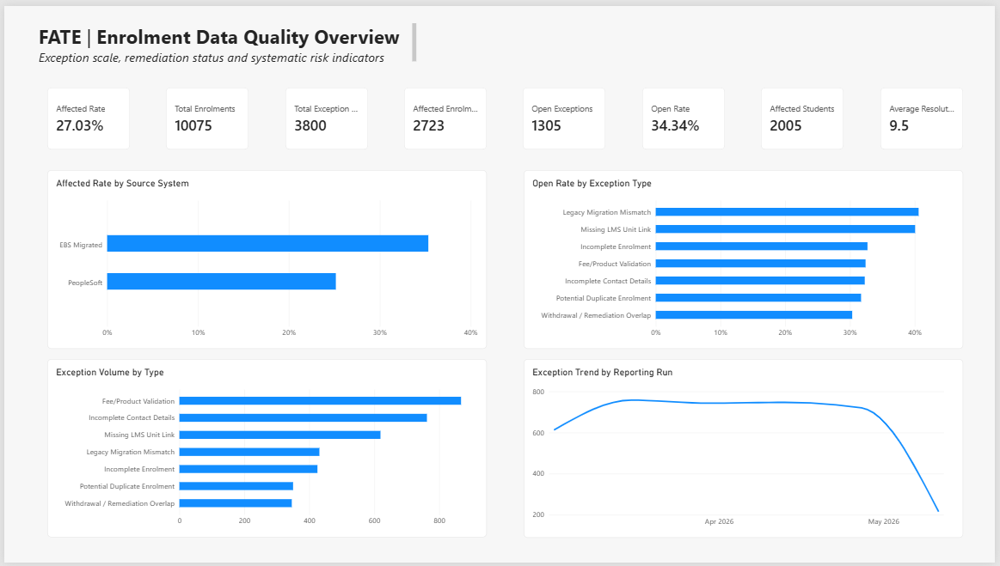
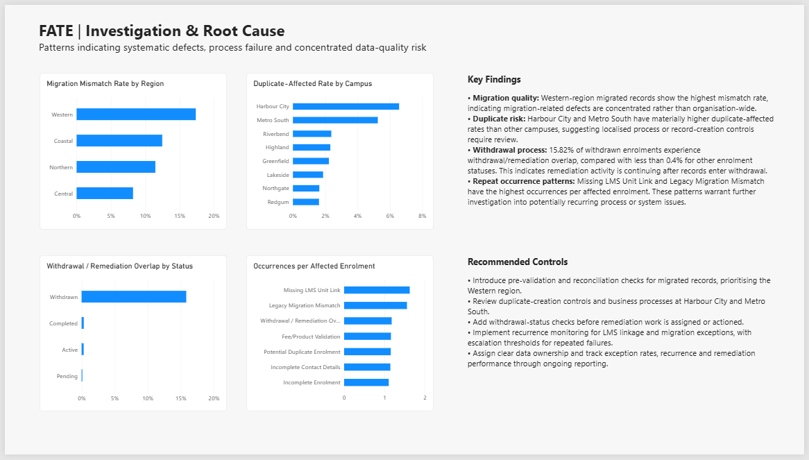

# FATE | Enrolment Data Quality & Operational Improvement

A portfolio case study investigating recurring enrolment data-quality exceptions within **FATE — Fictional Academy of Training and Education**, a synthetic statewide vocational education provider.

The project demonstrates an end-to-end analytical workflow using **SQL Server / T-SQL, Power Query, Power BI, DAX, data-quality analysis, root-cause analysis, process improvement and data governance**.

> **Important:** FATE is fictional and all data used in this project is synthetic. No real student, employer or organisational data is included.

---

## Project Overview

FATE was experiencing recurring enrolment exceptions across its student administration processes.

Operational teams were managing exception records, but some enrolments appeared in exception reporting more than once. Management needed to understand:

- the scale of the data-quality problem;
- which exception types generated the greatest workload;
- whether certain systems, locations or delivery modes carried greater risk;
- how often the same enrolments appeared in exception reporting, and whether follow-up investigation was warranted;
- which patterns suggested systemic rather than isolated issues;
- how remediation processes could be improved;
- what preventative controls should be introduced.

The project was designed to move beyond exception counts to assess **potential systemic drivers, operational risks and preventative controls**. The underlying root causes and effectiveness of proposed controls remain hypotheses until tested.

---

## Business Questions

The analysis addressed six core questions:

1. What is the scale and composition of the enrolment data-quality problem?
2. Which exception types, locations, systems and processes generate the greatest risk or workload?
3. Which enrolments have multiple exception occurrences, and does that justify further investigation of recurring issues?
4. What patterns indicate systemic rather than isolated problems?
5. What are the likely root causes and downstream operational consequences?
6. What controls, monitoring and process improvements should FATE implement?

---

## Tools & Capabilities

| Area | Tools / Techniques |
|---|---|
| Database | SQL Server 2025 |
| Querying | T-SQL |
| Data preparation | Power Query |
| Analysis | SQL, DAX, Power BI |
| Data modelling | Relational modelling, one-to-many relationships |
| Data Quality | Completeness, uniqueness, validity, consistency |
| Investigation | Segmentation, repeat-occurrence analysis, exception-rate analysis |
| Root Cause Assessment | Evidence-based hypotheses about system, process, location and workflow risks |
| Business Analysis | Business questions, process risks, controls and recommendations |
| Governance | Data-quality rules, ownership, monitoring and escalation |
| Visualisation | Power BI dashboards |
| Documentation and QA | GitHub repository, data dictionary, rule catalogue and recorded validation tests |

---

## Dataset

The synthetic project dataset contains:

| Dataset | Records |
|---|---:|
| Students | 4,200 |
| Enrolments | 10,075 |
| Exception occurrences | 3,800 |
| Reporting runs | 6 |
| Data-quality rules | 7 |

The data represents fictional enrolments across multiple campuses, regions, faculties, study modes and student-administration systems.

### Main tables

**Students**
- Student identifier
- Date of birth
- Home region
- Residency

**Enrolments**
- Enrolment and student identifiers
- Campus and region
- Product and qualification
- Faculty
- Study mode
- Source system
- Enrolment status
- Contact-information indicators
- LMS link status
- Fee/product status
- Migration indicator

**Exceptions**
- Exception occurrence
- Enrolment and student identifiers
- Exception code and type
- Data-quality dimension
- Severity
- Reporting date
- Remediation status
- Resolution date
- Remediation action

**DQ Rules**
- Rule identifier
- Data-quality dimension
- Rule definition
- Failure indicator
- Business impact

---

## Analytical Architecture

The project combines two related workflows: SQL investigation and validation, and Power BI reporting. Both inform the findings and recommendations.

```text
Synthetic Source Data
        ↓
SQL Server
        ├── T-SQL investigation and QA checks
        │
        └── Power Query preparation
                     ↓
              Power BI data model
                     ↓
                 DAX measures
                     ↓
              Management reporting
                     ↓
         Findings and root-cause hypotheses
                     ↓
            Proposed process controls
```

The Power BI model uses:

```text
Students
   1
   │
   *
Enrolments
   1
   │
   *
Exceptions
```

`DQ_Rules` is retained as a separate governance/reference table.

---

## Data Preparation

Power Query was used to prepare the SQL Server data for analytical modelling.

Key preparation activities included:

- validating column data types;
- explicitly applying Australian date handling;
- standardising student, enrolment and product identifiers;
- preserving null resolution dates for unresolved exceptions;
- creating a `ResolutionDays` field;
- validating relational keys before creating the Power BI model.

Examples of standardised identifiers include:

```text
StudentID     S001086
EnrolmentID   E0000001
ProductID     P108
CampusID      C08
```

The related identifiers were subsequently checked with SQL referential-integrity tests (QA09–QA11 and QA16).

---

## SQL Analysis

The published [T-SQL script](SQL/FATE_SQL_Analysis.sql) contains **four diagnostic investigations**, followed by database validation and integrity checks:

1. Duplicate-affected enrolment rates by campus.
2. Withdrawal/remediation overlap by enrolment status.
3. Open workloads and average resolution time by exception type.
4. Exception occurrences and open rates by reporting run.

It demonstrates `INNER JOIN`, `LEFT JOIN`, CTEs, `COUNT(DISTINCT)`, `CASE`, conditional aggregation, denominator-aware rates and `DATEDIFF` calculations.

Broader analysis of affected enrolments, source systems, regions and occurrence frequency is presented through the [Power BI report](PowerBI/FATE_Data_Quality_Analysis.pbix) and the findings below. These should not be mistaken for additional published SQL query sections.

### Validation and QA

[Testing_and_QA.md](Documentation/Testing_and_QA.md) records the following work executed in SQL Server on **8 October 2026**:

| Test references | Validation | Recorded result |
|---|---|---|
| QA01–QA04 | Student, enrolment, exception and rule-table counts | All four matched baseline |
| QA05–QA08 | Execution of four diagnostic SQL investigations | All four returned results without reported SQL errors |
| QA09–QA11 | Orphan exceptions, orphan enrolments and resolution-date ordering | Zero failed records for each check |
| QA12 | Exception-code to rule-ID coverage | Zero failed records |
| QA13–QA16 | Remediation status, resolution-date completeness and student-reference consistency | Zero failed records for each check |
| QA17 | Exception-to-source reconciliation for EX01, EX02, EX05 and EX06 | 327 occurrences flagged for investigation; not a pass/fail result |

### QA17 — Additional investigation

QA17 compared the recorded exception occurrences against **currently stored** enrolment attributes for four selected exception categories. It flagged **327 of 2,679 occurrences (12.2%)** for further review, of which **116** have an Open remediation status.

| Exception | Occurrences examined | Flagged for review | Flagged and Open |
|---|---:|---:|---:|
| EX01 — Incomplete Contact Details | 762 | 46 | 14 |
| EX02 — Missing LMS Unit Link | 619 | 193 | 72 |
| EX05 — Legacy Migration Mismatch | 431 | 48 | 12 |
| EX06 — Fee/Product Validation | 867 | 40 | 18 |
| **Total** | **2,679** | **327** | **116** |

**Interpretation:** QA17 identified discrepancies that require investigation; it did **not** establish 327 false positives or confirmed errors. The dataset lacks historical enrolment-attribute snapshots needed to distinguish valid historical exceptions from corrected records, rule-definition gaps or classification problems. The EX02 online-versus-On-Campus rule applicability requires business clarification. The investigation and follow-up actions are documented in the [QA evidence](Documentation/Testing_and_QA.md), [rule catalogue](Documentation/Data_Quality_Rules.md) and [process-improvement analysis](Documentation/Process_Improvement.md).

**Validation scope:** Passing record-count and integrity checks establishes only the conditions tested. Successful execution of QA05–QA08 confirms the queries ran, not that every analytical interpretation is independently validated. Full Power BI metric reconciliation, refresh logging and the final reporting run's coverage are separate verification considerations.

---

# Key Findings

## 1. Data-quality exceptions affected more than one quarter of enrolments

Of **10,075 enrolments**, **2,723** experienced at least one exception.

**Affected enrolment rate: 27.03%**

A total of **2,005 students** were represented in the affected enrolment population.

---

## 2. A substantial remediation backlog remained

Across **3,800 exception occurrences**:

- **2,495** were resolved;
- **1,305** remained open;
- overall open rate was **34.34%**.

Average resolution time for resolved exceptions was approximately **9.5 days**.

---

## 3. Fee/Product Validation generated the greatest workload

Exception volume by type:

| Exception type | Occurrences | Affected enrolments |
|---|---:|---:|
| Fee/Product Validation | 867 | 748 |
| Incomplete Contact Details | 762 | 666 |
| Missing LMS Unit Link | 619 | 381 |
| Legacy Migration Mismatch | 431 | 277 |
| Incomplete Enrolment | 425 | 385 |
| Potential Duplicate Enrolment | 350 | 303 |
| Withdrawal / Remediation Overlap | 346 | 294 |

Volume alone, however, did not identify the most systemic problems.

---

## 4. LMS and migration problems showed the highest occurrence frequency

The highest occurrence-per-affected-enrolment ratios were:

| Exception type | Occurrences per affected enrolment |
|---|---:|
| Missing LMS Unit Link | **1.62** |
| Legacy Migration Mismatch | **1.56** |
| Withdrawal / Remediation Overlap | 1.18 |
| Fee/Product Validation | 1.16 |
| Potential Duplicate Enrolment | 1.16 |
| Incomplete Contact Details | 1.14 |
| Incomplete Enrolment | 1.10 |

The **Missing LMS Unit Link** and **Legacy Migration Mismatch** categories generated more recorded occurrences per affected enrolment than other types. This is a useful signal for further investigation, but it does **not**, on its own, establish that an issue returned after successful remediation or prove a systemic cause.

---

## 5. Migrated records had higher observed exception exposure

Affected-enrolment rates differed by source system in the synthetic dataset:

| Source system | Affected rate |
|---|---:|
| EBS Migrated | **35.34%** |
| PeopleSoft | **25.16%** |

Migrated records therefore showed approximately a **10 percentage-point higher exception exposure**.

---

## 6. Migration problems were geographically concentrated

Legacy migration mismatch rates among migrated records were:

| Region | Migration mismatch rate |
|---|---:|
| Western | **17.36%** |
| Coastal | 12.47% |
| Northern | 11.47% |
| Central | 8.22% |

The Western region's observed rate was more than twice Central's. This supports prioritising a regional investigation, without establishing the reason for the difference.

---

## 7. Duplicate risk was concentrated at specific campuses

The strongest duplicate-affected rates were:

| Campus | Duplicate-affected rate |
|---|---:|
| Harbour City | **6.56%** |
| Metro South | **5.25%** |
| Riverbend | 2.37% |
| Highland | 2.31% |
| Greenfield | 2.22% |

The sharp difference between the two leading campuses and the remainder suggests local process or record-creation controls require further review.

---

## 8. Withdrawal/remediation overlap indicated a process-control risk

Withdrawal/remediation overlap was highly concentrated among withdrawn records:

| Enrolment status | Overlap rate |
|---|---:|
| Withdrawn | **15.82%** |
| Completed | 0.33% |
| Active | 0.32% |
| Pending | 0.12% |

The overlap suggests a potential **workflow and business-process control risk**. However, the aggregate counts alone do not establish whether remediation happened before or after a withdrawal-status change; event-level lifecycle timestamps or process evidence would be needed to confirm that sequence.

---

## Power BI — Data Quality Overview

The first report page provides an executive overview of:

- total enrolments;
- affected enrolments;
- affected students;
- exception volume;
- open workload;
- affected and open rates;
- resolution performance;
- source-system risk;
- exception composition;
- reporting-run trends.



---

## Power BI — Investigation & Root Cause

The second report page focuses on diagnostic analysis:

- migration mismatch by region;
- duplicate-affected rate by campus;
- withdrawal/remediation overlap;
- exception occurrences per affected enrolment.



---

# Root Cause Assessment

The findings support several **root-cause hypotheses** requiring process or system-level validation. Associations and rates alone do not prove specific technical or operational causes.

### Migration quality

Higher exception rates among migrated records, particularly in the Western region, suggest migration-related mapping, transformation or validation weaknesses.

### LMS linkage

The relatively high occurrence-per-affected-enrolment ratio for Missing LMS Unit Link justifies investigating whether upstream integration or validation controls contribute to repeated exceptions. It does not show that previous remediation failed.

### Duplicate creation

Concentration at Harbour City and Metro South suggests localised workflow, user-process or record-creation controls may differ from other campuses.

### Withdrawal workflow

The association between withdrawn status and EX04 exceptions warrants testing whether remediation workflows sufficiently account for enrolment lifecycle changes. The event sequence is not proven by these summary results.

---

# Proposed Controls

These are recommendations derived from the synthetic analysis. They have **not** been implemented or shown to improve real operational outcomes.

## 1. Migration validation

Introduce pre-validation and reconciliation checks for migrated records, with targeted investigation of Western-region migration outcomes.

## 2. Duplicate prevention

Review record-creation processes at Harbour City and Metro South and introduce duplicate checks before new enrolment records are committed.

## 3. Withdrawal-status validation

Check current enrolment status before remediation work is assigned or actioned.

Records already progressing through withdrawal should be paused, filtered or routed through the appropriate withdrawal process.

## 4. Recurrence monitoring

Define thresholds for multiple occurrences against the same enrolment and exception type. Confirm whether incidents remain unresolved, have been re-opened or represent genuinely new events before escalating from record-level remediation to process-level investigation.

## 5. Data ownership

Assign clear ownership for major data-quality domains and exception categories.

Owners should be responsible for:

- monitoring;
- investigation;
- remediation;
- escalation;
- preventative controls;
- closure validation.

## 6. Ongoing reporting

Continue monitoring:

- exception rates;
- recurrence;
- unresolved workload;
- resolution time;
- location/system concentrations;
- control effectiveness.

---

# Data Quality Framework

The project uses seven defined data-quality rules spanning key dimensions including:

- **Completeness**
- **Uniqueness**
- **Validity**
- **Consistency**

Each rule connects:

```text
Business Requirement
        ↓
Data Quality Rule
        ↓
Validation / Exception
        ↓
Investigation
        ↓
Root Cause
        ↓
Control
        ↓
Monitoring
```

This framework proposes a transition from reactive correction toward prevention and governance. Effectiveness would need to be demonstrated through implementation and follow-up monitoring.

---

# Skills Demonstrated

### Data Analysis
- exploratory analysis;
- segmentation;
- KPI design;
- comparative rates;
- analysis of multiple occurrences per affected enrolment;
- trend analysis;
- interpretation of operational data.

### SQL / T-SQL
- joins;
- CTEs;
- aggregations;
- conditional logic;
- distinct counts;
- calculated rates;
- date calculations;
- analytical query design.

### Power Query
- key standardisation;
- type validation;
- locale handling;
- null handling;
- calculated columns;
- transformation sequencing.

### Power BI / DAX
- relational modelling;
- reusable measures;
- KPI cards;
- interactive cross-filtering;
- management dashboards;
- investigative reporting.

### Data Quality
- quality dimensions;
- exception management;
- repeat-occurrence analysis;
- remediation monitoring;
- rule-based controls.

### Business Analysis
- business-question definition;
- process-risk identification;
- root-cause investigation;
- business-control design;
- recommendations.

### Governance & Process Improvement
- data ownership;
- proposed preventative controls;
- monitoring thresholds;
- remediation workflow redesign recommendations;
- escalation design.

---

# Repository Structure

```text
FATE/
│
├── README.md
│
├── Data/
│
├── Documentation/
│   ├── Data_Dictionary.md
│   ├── Data_Quality_Rules.md
│   ├── Process_Improvement.md
│   └── Testing_and_QA.md
│
├── Images/
│   ├── 01_Data_Quality_Overview.png
│   └── 02_Investigation_Root_Cause.png
│
├── PowerBI/
│   └── FATE_Data_Quality_Analysis.pbix
│
└── SQL/
    └── FATE_SQL_Analysis.sql
```

---

# Project Status

**Core analytical release and supporting documentation published.**

Completed and included in this repository:

- synthetic dataset and SQL Server implementation;
- four T-SQL diagnostic investigations, recorded QA01–QA16 checks, and the QA17 exception-to-source investigation;
- Power Query preparation, relational data model and DAX measures;
- two Power BI report pages and exported screenshots;
- findings, root-cause hypotheses and proposed controls;
- [data dictionary](Documentation/Data_Dictionary.md) and [data-quality rule catalogue](Documentation/Data_Quality_Rules.md);
- [current-state and future-state process improvement analysis](Documentation/Process_Improvement.md);
- [testing and QA documentation](Documentation/Testing_and_QA.md).

**Remaining verification limitations:** Independent reconciliation of all Power BI measures against SQL, evidence of the latest Power BI refresh status, and an explanation for the smaller final reporting run have not been fully documented. The final reporting run (11 May 2026: 218 occurrences) is materially smaller than earlier runs; it must not be interpreted as confirmed improvement without assessing reporting coverage. The QA17 flags also remain investigation items rather than confirmed data errors because historical attribute snapshots and validated rule applicability are not available.

Potential later extension:

- Python/pandas validation workflow;
- automated exception monitoring;
- responsible AI-assisted triage assessment.

---

## Development Note

AI-assisted tools were used during development to support ideation, troubleshooting, documentation and iterative problem solving.

The project author reviewed query execution, reported results, model behaviour, interpretation and recommendations. AI-assisted output was not treated as evidence without checking it against the project data and implemented work.

This reflects a **human-in-the-loop approach to AI-assisted analytical development**.

---

## Disclaimer

This project is a fictional portfolio case study.

**FATE — Fictional Academy of Training and Education** is not a real education provider. All student, enrolment, system, campus and exception data is synthetic and was created specifically for analytical demonstration purposes.
